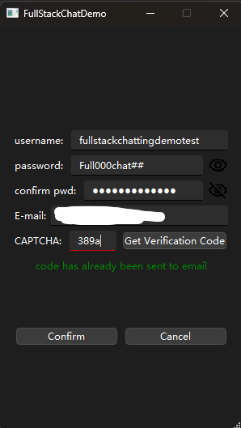
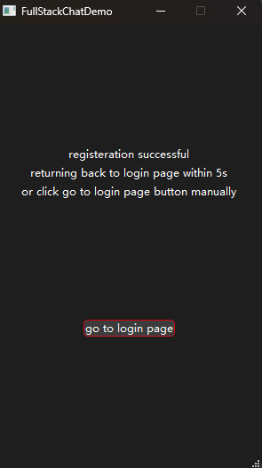
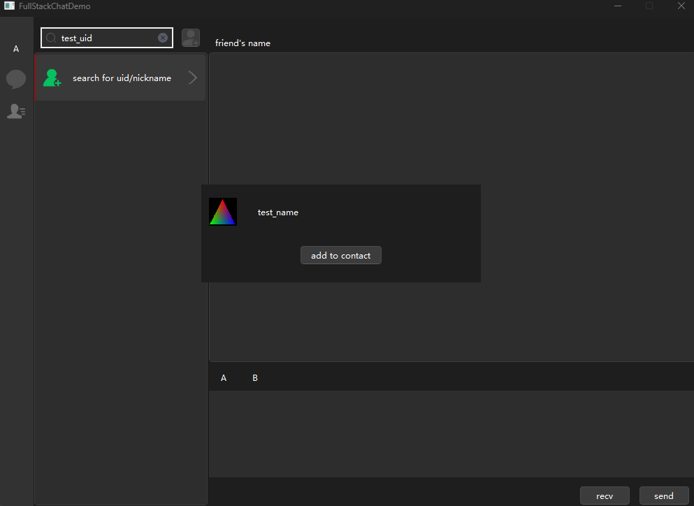

# FullStackChattingDemo
## Description

FullStackChattingDemo using C++17 standard

## Client

### Libraries

using QT6(Q::Widgets Qt::Network)

### Main page


### Register page






### Chatting Main Dialog


### Search and add new contact




### Contact Page


## **Servers**

### Libraries

**The libraries we use**

boost-1.84  (beast asio uuid mysql), grpc-1.50.2, hiredis, jsoncpp, ada(url parsing), spdlog

**For Linux/MacOS users, it's strongly recommend to install boost-1.84 in your system!!**

grpc-1.50.2 will be downloaded automatically, and we will use boringssl instead of openssl

**For Windows users, fetch content will download all of those for you**


### Server List

1. gateway-server(accept user's registration & login & forgot password requests)

   **/get_test(GET method)**: system functionality test.

   

   **/get_verification(POST method)**

   User sends get CPATCHA request to server. server using GRPC protocol to communicate with NodeJS server and generate and store uuid in Redis DB.

   **/post_registration(POST method)**

   User post registration request to server. server store info into DB.

   **/check_accountexists(POST method)**

   user post there account name and email request to server, server has to return the existance of the account

   **/reset_password(POST method)**

    after the procedure of check_accountexists, the user has to input new password and passing the password correctness checking. the request will be send to the server and store into DB.

   **/trylogin_server(POST method)**

   user pass username & password to server, and server validating those parameters in DB and allocate a chattingserver through balance-server

   ~~**/getavator(POST method)**~~

   ~~Currently not support~~

   

2. balance-server(loading balance)

3. chatting-server

4. captcha-server

   **imported libraries**

   import ioredis, grpc-js proto-loader, nodemailer, uuidv4 libraries to the project

   

   **Sending verification code to server**

   

   


​									


## Requirements

The project is self-contained almost all dependencies on both Windows and Linux/Unix-like systems.

### Main Server(C++)

main server using config.ini to store parameters

```ini
[GateServer]
port = 8080
[VerificationServer]
host=127.0.0.1
port = 65500
[MySQL]
username=root
password=123456
database=chatting
host=localhost
port=3307
timeout=60          #timeoutsetting seconds
[Redis]
host=127.0.0.1
port=16379
password=123456
[BalanceService]
host=127.0.0.1
port=8000
```

### Verification Server(Nodejs)

verification server using verification-server/config.json to store parameters

```json
{
      "email": {
                "host": "please set to your email host name",
                "port": "please set to your email port",
                "username": "please set to your email address",
                "password": "please use your own authorized code"
      },
      "mysql": {
                "host": "127.0.0.1",
                "port": 3307,
                "password": 123456
      },
      "redis": {
                "host": "127.0.0.1",
                "port": 16379,
                "password": 123456
      }
}
```

### Redis Server

1. Create a volume on host machine

   ```bash
   #if you are using windows, please download WSL2
   mkdir -p /path/to/redis/{conf,data} 
   ```

2. Download Redis configuration file

   ```bash
   vim /path/to/redis/conf/redis.conf	#write config file(you could use other editing tools!)
   ```

3. Configuration file setting

   ```ini
   # bind 192.168.1.100 10.0.0.1     # listens on two specific IPv4 addresses
   # bind 127.0.0.1 ::1              # listens on loopback IPv4 and IPv6
   # bind * -::*                     # like the default, all available interfaces
   # bind 127.0.0.1 -::1
   protected-mode no
   port 6379
   tcp-backlog 511
   timeout 0
   tcp-keepalive 300
   daemonize no
   pidfile /var/run/redis_6379.pid
   loglevel notice
   logfile ""
   databases 16
   always-show-logo no
   set-proc-title yes
   proc-title-template "{title} {listen-addr} {server-mode}"
   locale-collate ""
   stop-writes-on-bgsave-error yes
   rdbcompression yes
   rdbchecksum yes
   dbfilename dump.rdb
   rdb-del-sync-files no
   dir ./
   #password
   requirepass 123456
   replica-serve-stale-data yes
   replica-read-only yes
   repl-diskless-sync yes
   repl-diskless-sync-delay 5
   repl-diskless-sync-max-replicas 0
   repl-diskless-load disabled
   repl-disable-tcp-nodelay no
   replica-priority 100
   acllog-max-len 128
   lazyfree-lazy-eviction no
   lazyfree-lazy-expire no
   lazyfree-lazy-server-del no
   replica-lazy-flush no
   lazyfree-lazy-user-del no
   lazyfree-lazy-user-flush no
   oom-score-adj no
   oom-score-adj-values 0 200 800
   disable-thp yes
   appendonly no
   appendfilename "appendonly.aof"
   appenddirname "appendonlydir"
   appendfsync everysec
   no-appendfsync-on-rewrite no
   auto-aof-rewrite-percentage 100
   auto-aof-rewrite-min-size 64mb
   aof-load-truncated yes
   aof-use-rdb-preamble yes
   aof-timestamp-enabled no
   slowlog-log-slower-than 10000
   slowlog-max-len 128
   latency-monitor-threshold 0
   notify-keyspace-events ""
   hash-max-listpack-entries 512
   hash-max-listpack-value 64
   list-max-listpack-size -2
   list-compress-depth 0
   set-max-intset-entries 512
   set-max-listpack-entries 128
   set-max-listpack-value 64
   zset-max-listpack-entries 128
   zset-max-listpack-value 64
   hll-sparse-max-bytes 3000
   stream-node-max-bytes 4096
   stream-node-max-entries 100
   activerehashing yes
   client-output-buffer-limit normal 0 0 0
   client-output-buffer-limit replica 256mb 64mb 60
   client-output-buffer-limit pubsub 32mb 8mb 60
   hz 10
   dynamic-hz yes
   aof-rewrite-incremental-fsync yes
   rdb-save-incremental-fsync yes
   jemalloc-bg-thread yes
   
4. Create Redis container

   ```bash
   #Pull the official docker image from Docker hub
   	docker pull redis:7.2.4
   	
   #create container
   docker run \
   --restart always \
   -p 16379:6379 --name redis \
   --privileged=true \
   -v /path/to/redis/conf/redis.conf:/etc/redis/redis.conf \
   -v /path/to/redis/data:/data:rw \
   -d redis:7.2.4 redis-server /etc/redis/redis.conf \
   --appendonly yes
   ```

5. Entering Redis container

   ```bash
   #entering redis
   	docker exec -it redis bash
   	
   # login redis db
   	redis-cli
   ```


### MySQL Server

1. Create a volume on host machine

   ```bash
   #if you are using windows, please download WSL2
   mkdir -p /path/to/mysql/{conf,data} 
   ```

2. Create a configuration file(my.cnf)

   ```bash
   touch /path/to/mysql/conf/my.cnf	#create
   vim /path/to/mysql/conf/my.cnf		#write config file(you could use other editing tools!)
   ```

3. Configuration file setting

   ```ini
   [mysqld]
   default-authentication-plugin=mysql_native_password
   skip-host-cache
   skip-name-resolve
   datadir=/var/lib/mysql
   socket=/var/run/mysqld/mysqld.sock
   secure-file-priv=/var/lib/mysql-files
   user=mysql
   character-set-server=utf8
   max_connections=200
   max_connect_errors=10
   pid-file=/var/run/mysqld/mysqld.pid
   [client]
   socket=/var/run/mysqld/mysqld.sock
   default-character-set=utf8
   !includedir /etc/mysql/conf.d/
   ```
   
4. Create MySQL container

   **If you intended to pass a host directory, please use absolute path.**

   ```bash
   #Pull the official docker image from Docker hub
   	docker pull mysql:8.0
   	
   #Start a mysql server instance
   	 docker run --restart=on-failure:3 -d \
   	-v /path/to/mysql/conf:/etc/mysql/conf.d \
       -v /path/to/mysql/data:/var/lib/mysql \
   	-e MYSQL_ROOT_PASSWORD="your_password" \
   	-p 3307:3306 --name "your_container_name" \
       mysql:8.0
   ```

5. Entering mysql and login DB

   ```bash
   #entering mysql
   	docker exec -it "your_container_name" bash
   	
   # login mysql db ( -u: root by default, -p password)
   	mysql -uroot -p"your_password" 
   ```


6. **DataBase Has to be created, before starting the main server!!!**

   You could choose DataBase tools to create database and table
   
   ```sql
   CREATE DATABASE chatting;
   
   -- Create Authentication Table
   CREATE TABLE chatting.Authentication (
       uuid INT AUTO_INCREMENT PRIMARY KEY,
       username VARCHAR(50) NOT NULL UNIQUE,
       password VARCHAR(255) NOT NULL,
       email VARCHAR(100) UNIQUE
   );
   
   -- Create UserProfile Table
   CREATE TABLE chatting.UserProfile (
       uuid INT PRIMARY KEY,
       avatar VARCHAR(255),
       nickname VARCHAR(50),
       description TEXT,
       sex BOOL,
       FOREIGN KEY (uuid) REFERENCES Authentication(uuid) ON DELETE CASCADE
   );
   
   -- Create Friend Request Table
   CREATE TABLE chatting.FriendRequest(
       id INT AUTO_INCREMENT PRIMARY KEY,
   	src_uuid INT NOT NULL,
       dst_uuid INT NOT NULL,
       nickname VARCHAR(255),
       message VARCHAR(255),
       status BOOL,	-- request status
       FOREIGN KEY (src_uuid) REFERENCES Authentication(uuid) ON DELETE CASCADE,
       FOREIGN KEY (dst_uuid) REFERENCES Authentication(uuid) ON DELETE CASCADE
   );
   ```


## Developer Quick Start

### Platform Support
Windows, Linux, MacOS(Intel & Apple Silicon M)

### Download FullStackChattingDemo

```bash
git clone https://github.com/Liupeter01/FullStackChattingDemo
```

### Compile Client

1. For Windows

   ```bash
   #please import client dir to qt creator
   ```

2. For MacOS/Linux

   ```bash
   #It might take a long time to download dependency libraies!!!!
   cd FullStackChattingDemo/client
   cmake -Bbuild -DCMAKE_BUILD_TYPE=Release
   cmake --build build --parallel [x]
   ```

### Compile GatewayServer/BalanceServer/Chattingserver

1. For Linux/Windows

   ```bash
   cd FullStackChattingDemo/server
   git submodule update --init
   cmake -Bbuild -DCMAKE_BUILD_TYPE=Release
   cmake --build build --parallel [x]
   ```

2. For MacOS

   ```bash
   cd FullStackChattingDemo/server
   git submodule update --init
   cmake -Bbuild -DCMAKE_BUILD_TYPE=Release -DCMAKE_INCLUDE_PATH=/usr/local/include
   cmake --build build --parallel [x]
   ```


### How to Execute

1. Activate Redis and MySQL service

   **IMPORTANT: you have to start those services first!!**

   

2. Execute Servers' program

   ```bash
   ./balance-server/build/BalanceServer
   ./gateway-server/build/GatewayServer
   ./chatting-server/build/ChattingServer
   ```

3. Execute captcha-server(Nodejs)

   ```bash
   cd captcha-server
   npm install
   node index.js  # you could use nodemon
   ```

4. Execute Client

   ```bash
   ./client/build/ChattingClient
   ```


### Error Handling

1. SyntaxError: Unexpected token  in JSON at position 0
   ```bash
   SyntaxError: Unexpected token  in JSON at position 0
       at JSON.parse (<anonymous>)
   ```

   Solving
   please change your encoding method to UTF-8, especially for VSCode user

   Referring Url
   https://stackoverflow.com/questions/55960919/nodejs-syntaxerror-unexpected-token-in-json-at-position-0

   

2. undefined symbol upb_alloc_global
   ```cmake
   set(protobuf_BUILD_LIBUPB OFF)
   ```

   Referring Url
   https://github.com/grpc/grpc/issues/35794

   

3. fatal error: 'unicode/locid.h' 'unicode/ucnv.h' file not found (usually happened on MacOS)
   Download icu 74.1
   ```bash
   wget https://github.com/unicode-org/icu/releases/download/release-74-1/icu4c-74_1-src.tgz
   ```

   Compile and Install
   ```bash
   git clone https://github.com/unicode-org/icu.git
   cd icu/source
   ./configure && make -j[x]
   sudo make install
   ```

   set cmake variable
   ```cmake
   cmake -Bbuild -DCMAKE_INCLUDE_PATH=/usr/local/include
   cmake --build build --parallel x
   ```

   Referring Url
   https://unicode-org.github.io/icu/userguide/icu4c/build.html

   

4. boringssl undefined win32
   ```cmake
   set(OPENSSL_NO_ASM ON)
   ```

   Referring Url
   https://github.com/grpc/grpc/issues/16376

   

5. Handling gRPC issue
   Issue description

   ```bash
   CMake Error: install(EXPORT "protobuf-targets" ...) includes target "libprotobuf-lite" which requires target "absl_node_hash_map" that is not in any export set.
   ```

   Problem Solving
   ```cmake
   set(ABSL_ENABLE_INSTALL ON)
   ```

   Referring Url
    https://github.com/protocolbuffers/protobuf/issues/12185
    https://github.com/protocolbuffers/protobuf/issues/12185#issuecomment-1594685860

   

6. E No address added out of total 1 resolved

   you have to start the main server first and then open nodejs service

   
