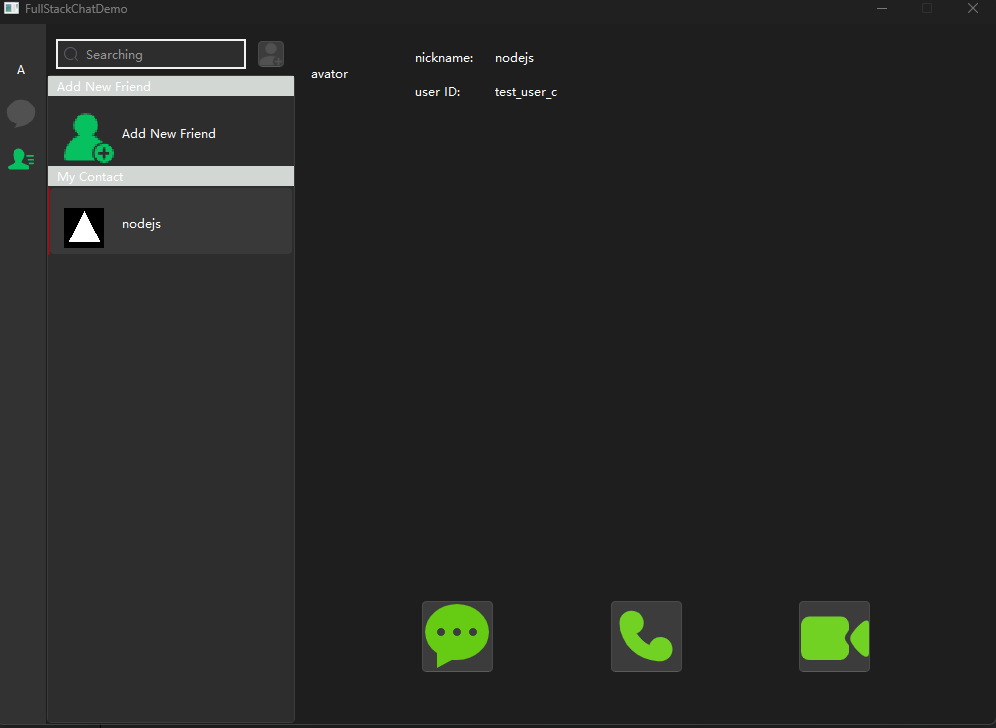
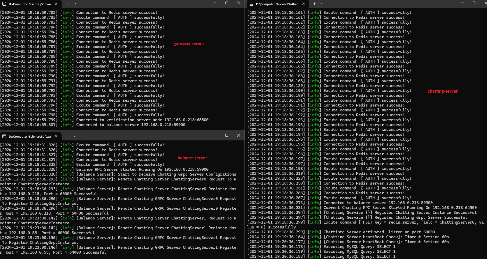

# Distributed-Chat-System-Development
## 0x00 Description

Distributed-Chat-System-Development is a real-time chat application built using C++17, Boost and gRPC, featuring a distributed TCP server architecture. 

1. **Frontend Development:**

   - Developed a chat dialog using **Qt**, leveraging `QListWidget` for an efficient chat record list and combining `QGridLayout` and `QPainter` for customized chat bubble styling to enhance the user experience.
   - Encapsulated **Qt Network** modules to support HTTP and CP service communication.
   - Implemented core features such as adding friends, friend communication, and chat record display.

   **Backend Architecture Design:**

   - Designed a distributed service architecture with the following components:
     - **`gateway-server` (Gateway Service):** Provides HTTP APIs to handle user login, registration, and authentication.
     - **`chatting-server` (Chat Service):** Utilized ASIO to implement efficient TCP long connection communication.
     - **`balance-server` (Load Balancing Service):** Allocates chat services dynamically to achieve load balancing.
     - **`captcha-server` (Captcha Service):** Generates and validates captchas for enhanced security.
   - Enabled inter-service communication using the **gRPC protocol**, ensuring high availability and support for reconnections.

   **High-Performance Optimization:**

   - Implemented multithreading with `io_context` pools in the `chatting-server` to boost concurrent performance.
   - Developed a **MySQL connection pool** to manage user data, friend relationships, and chat records.
   - Designed a **Redis connection pool** for caching optimization.
   - Built a gRPC connection pool to enhance distributed service access efficiency.

   **Technical Highlights:**

   - Gateway service provides **stateful HTTP interfaces** and integrates load balancing functionality.
   - Chat service supports **asynchronous message forwarding** with reliable TCP long connections.
   - Achieved support for **8000+ concurrent connections** on a single server, with distributed deployment supporting **10K-20K active users**.

   

   **we are going to use boringssl instead of openssl for gRPC framework**


## 0x01 All Servers in this project

### Captcha-server

Captcha-server imported `ioredis`, `grpc-js`, `pproto-loader`, `nodemailer`, `uuidv4` libraries to the project. 

### Balance-server

### Chatting-server

1. User Login`(SERVICE_LOGINSERVER)`

2. ~~User Logout`SERVICE_LOGOUTSERVER`~~

3. User Search For Peers`(SERVICE_SEARCHUSERNAME)`

4. User Who Initiated Friend Request `(SERVICE_FRIENDREQUESTSENDER)`

5. User Who Received Friend Request`(SERVICE_FRIENDREQUESTCONFIRM)`

   

### Gateway-server

All services are using HTTP short connections, users are going to create a POST method to the gateway-server and gateway-server is going to respond to the client requests accordingly.

1. `/get_verification`

   User sends a email address to gateway-server and request to get a Email verification code(CPATCHA) request to server. server using **gRPC** protocol to communicate with NodeJS server(`captcha-server`) and create an unique **uuid** for the user. The **uuid** is going to store in a **Redis** memory database with a timeout setting, user should register the new account within the valid time or request for a new one instead.

   

2. `/post_registration`

   After request for a **valid CPATCHA**, user could trigger registration confirm button to post registration request to the server. Server will whether this user's identity is collision with any other user inside the system, if no collision found the info will be stored inside database. ~~however, SQL injection protection mechanism is still not available yet!~~

   

3. `/check_accountexists`

   After account registration, when user demands to change his/her password, we have to verifiy the account existance.

   

4. `/reset_password`

   After executing `/check_accountexists` process, then user could enter his/her new password info, and client terminal could send the new password info to the the server. server will do the similiar process in `/post_registration` and alter the existing data inside the database.

   

5. `/trylogin_server`

   please be careful, `trylogin_server` **could not login into** the real server directly. **It's a server relay!**

   The identification is similiar to `/check_accountexists` authenication process. The `gateway-server` will communicate with `balance-server` for the address of `chatting-server` by using **gRPC**, and `chatting-server` will do load-balancing and return the lowest load server info back. However, The user connection status **will not** maintained and managed by `gateway-server` and `gateway-server` doesn't care about this either, client will receive the real address of `chatting-server` and connecting to it by itself. ~~however, SQL injection protection mechanism is still not available yet!~~

   

## 0x02 Requirements

### Basic Infrastructures

**It's strongly suggested to use docker to build up those services ^_^**

**If you intended to pass a host directory, please use absolute path.**

1. Redis Memory Database

   Create a local volume on host machine and editing configration files. **Please don't forget to change your password.**

   ```bash
   #if you are using windows, please download WSL2
   mkdir -p /path/to/redis/{conf,data} 
   cat > /path/to/redis/conf/redis.conf <<EOF
   # bind 192.168.1.100 10.0.0.1     # listens on two specific IPv4 addresses
   # bind 127.0.0.1 ::1              # listens on loopback IPv4 and IPv6
   # bind * -::*                     # like the default, all available interfaces
   # bind 127.0.0.1 -::1
   protected-mode no
   port 6379
   tcp-backlog 511
   timeout 0
   tcp-keepalive 300
   daemonize no
   pidfile /var/run/redis_6379.pid
   loglevel notice
   logfile ""
   databases 16
   always-show-logo no
   set-proc-title yes
   proc-title-template "{title} {listen-addr} {server-mode}"
   locale-collate ""
   stop-writes-on-bgsave-error yes
   rdbcompression yes
   rdbchecksum yes
   dbfilename dump.rdb
   rdb-del-sync-files no
   dir ./
   #---------------------------password--------------------------------------------
   requirepass 123456
   #---------------------------------------------------------------------------------
   replica-serve-stale-data yes
   replica-read-only yes
   repl-diskless-sync yes
   repl-diskless-sync-delay 5
   repl-diskless-sync-max-replicas 0
   repl-diskless-load disabled
   repl-disable-tcp-nodelay no
   replica-priority 100
   acllog-max-len 128
   lazyfree-lazy-eviction no
   lazyfree-lazy-expire no
   lazyfree-lazy-server-del no
   replica-lazy-flush no
   lazyfree-lazy-user-del no
   lazyfree-lazy-user-flush no
   oom-score-adj no
   oom-score-adj-values 0 200 800
   disable-thp yes
   appendonly no
   appendfilename "appendonly.aof"
   appenddirname "appendonlydir"
   appendfsync everysec
   no-appendfsync-on-rewrite no
   auto-aof-rewrite-percentage 100
   auto-aof-rewrite-min-size 64mb
   aof-load-truncated yes
   aof-use-rdb-preamble yes
   aof-timestamp-enabled no
   slowlog-log-slower-than 10000
   slowlog-max-len 128
   latency-monitor-threshold 0
   notify-keyspace-events ""
   hash-max-listpack-entries 512
   hash-max-listpack-value 64
   list-max-listpack-size -2
   list-compress-depth 0
   set-max-intset-entries 512
   set-max-listpack-entries 128
   set-max-listpack-value 64
   zset-max-listpack-entries 128
   zset-max-listpack-value 64
   hll-sparse-max-bytes 3000
   stream-node-max-bytes 4096
   stream-node-max-entries 100
   activerehashing yes
   client-output-buffer-limit normal 0 0 0
   client-output-buffer-limit replica 256mb 64mb 60
   client-output-buffer-limit pubsub 32mb 8mb 60
   hz 10
   dynamic-hz yes
   aof-rewrite-incremental-fsync yes
   rdb-save-incremental-fsync yes
   jemalloc-bg-thread yes
   EOF
   ```

   Creating a `Redis` container and execute following commands.

   ```bash
   docker pull redis:7.2.4		#Pull the official docker image from Docker hub
   docker run \
       --restart always \
       -p 16379:6379 --name redis \
       --privileged=true \
       -v /path/to/redis/conf/redis.conf:/etc/redis/redis.conf \
       -v /path/to/redis/data:/data:rw \
       -d redis:7.2.4 redis-server /etc/redis/redis.conf \
       --appendonly yes
   ```

   Entering `Redis` container and access to command line `redis-cli`.

   ```bash
   docker exec -it redis bash	 #entering redis
   redis-cli									 	 #login redis db
   ```

2. MySQL Database

   Create a local volume on host machine and editing configration files. **Please don't forget to change your password.**

   ```bash
   #if you are using windows, please download WSL2
   mkdir -p /path/to/mysql/{conf,data} 
   touch /path/to/mysql/conf/my.cnf	#create
   cat > /path/to/redis/conf/redis.conf <<EOF
   [mysqld]
   default-authentication-plugin=mysql_native_password
   skip-host-cache
   skip-name-resolve
   datadir=/var/lib/mysql
   socket=/var/run/mysqld/mysqld.sock
   secure-file-priv=/var/lib/mysql-files
   user=mysql
   character-set-server=utf8
   max_connections=200
   max_connect_errors=10
   pid-file=/var/run/mysqld/mysqld.pid
   [client]
   socket=/var/run/mysqld/mysqld.sock
   default-character-set=utf8
   !includedir /etc/mysql/conf.d/
   EOF
   ```

   Creating a `MySQL` container and execute following commands.

   ```bash
   docker pull mysql:8.0		#Pull the official docker image from Docker hub
   docker run --restart=on-failure:3 -d \
       -v /path/to/mysql/conf:/etc/mysql/conf.d \
       -v /path/to/mysql/data:/var/lib/mysql \
       -e MYSQL_ROOT_PASSWORD="your_password" \
       -p 3307:3306 --name "your_container_name" \
       mysql:8.0
   ```

   Entering `MySQL` container and access to `mysql` command line.

   ```bash
   docker exec -it "your_container_name" bash		#entering mysql
   mysql -uroot -p"your_password"                #login mysql db ( -u: root by default, -p password)
   ```

   Initialise `MySQL` database with following `SQL` commands to create DB and table schemas.

   ```sql
   CREATE DATABASE chatting;
   
   -- Create Authentication Table
   CREATE TABLE chatting.Authentication (
       uuid INT AUTO_INCREMENT PRIMARY KEY,
       username VARCHAR(50) NOT NULL UNIQUE,
       password VARCHAR(255) NOT NULL,
       email VARCHAR(100) UNIQUE
    );
   
    -- Create UserProfile Table
    CREATE TABLE chatting.UserProfile (
       uuid INT PRIMARY KEY,
       avatar VARCHAR(255),
       nickname VARCHAR(50),
       description TEXT,
       sex BOOL,
       FOREIGN KEY (uuid) REFERENCES Authentication(uuid) ON DELETE CASCADE
    );
   
   -- Create Friend Request Table
   CREATE TABLE chatting.FriendRequest(
       id INT AUTO_INCREMENT PRIMARY KEY,
   	src_uuid INT NOT NULL,
       dst_uuid INT NOT NULL,
       nickname VARCHAR(255),
       message VARCHAR(255),
       status BOOL,	-- request status
       FOREIGN KEY (src_uuid) REFERENCES Authentication(uuid) ON DELETE CASCADE,
       FOREIGN KEY (dst_uuid) REFERENCES Authentication(uuid) ON DELETE CASCADE
   );
   
   -- Create Auth Friend Table
   CREATE TABLE chatting.AuthFriend(
       id INT AUTO_INCREMENT PRIMARY KEY,
   	self_uuid INT NOT NULL,
       friend_uuid INT NOT NULL,
   	alternative_name VARCHAR(255),	--
       FOREIGN KEY (self_uuid ) REFERENCES Authentication(uuid) ON DELETE CASCADE,
       FOREIGN KEY ( friend_uuid ) REFERENCES Authentication(uuid) ON DELETE CASCADE
   );
   
   CREATE UNIQUE INDEX idx_self_friend ON chatting.AuthFriend(self_uuid ASC, friend_uuid ASC) USING BTREE;
   ```


### Servers' Configurations

Most of those basic configurations are using *.ini file, except `Captcha-server`.

1. Captcha-server**(config.json)**

   ```bash
   {
         "email": {
                   "host": "please set to your email host name",
                   "port": "please set to your email port",
                   "username": "please set to your email address",
                   "password": "please use your own authorized code"
         },
         "mysql": {
                   "host": "127.0.0.1",
                   "port": 3307,
                   "password": 123456
         },
         "redis": {
                   "host": "127.0.0.1",
                   "port": 16379,
                   "password": 123456
         }
   }
   ```

   

2. Gateway-server**(config.ini)**

   ```ini
   [GateServer]
   port = 8080
   [VerificationServer]
   host=127.0.0.1
   port = 65500
   [MySQL]
   username=root
   password=123456
   database=chatting
   host=localhost
   port=3307
   #timeoutsetting(s) for heart pulse
   timeout=60 
   [Redis]
   host=127.0.0.1
   port=16379
   password=123456
   [BalanceService]
   host=127.0.0.1
   port=59900
   ```

   

3. Balance-server**(config.ini)**

   ```ini
   [BalanceService]
   host=127.0.0.1
   port=59900
   [Redis]
   host=127.0.0.1
   port=16379
   password=123456
   ```

   

4. Chatting-server**(config.ini)**

   ```ini
   [BalanceService]
   host=127.0.0.1
   port=59900
   [gRPCServer]
   server_name=ChattingServer0
   host=127.0.0.1
   port=64400
   [ChattingServer]
   port=60000
   send_queue_size=1000
   [Redis]
   host=127.0.0.1
   port=16379
   password=123456
   [MySQL]
   username=root
   password=123456
   database=chatting
   host=localhost
   port=3307
   #timeoutsetting(s) for heart pulse
   timeout=60
   ```

   

## 0x03 Developer Quick Start

### Platform Support
Windows, Linux, MacOS(Intel & Apple Silicon M)

### Download FullStackChattingDemo

```bash
git clone https://github.com/Liupeter01/FullStackChattingDemo
git submodule update --init --recursive
```

### Compile and build FullStackChattingDemo

Those are submodules building tutorial links.

[Gateway-server](https://github.com/Liupeter01/gateway-server/blob/main/README.md)

[Balance-server](https://github.com/Liupeter01/balance-server/blob/main/README.md)

[Chatting-server](https://github.com/Liupeter01/chatting-server/blob/main/README.md)

[Captcha-server](https://github.com/Liupeter01/captcha-server/blob/main/README.md)

[Chatting-client](https://github.com/Liupeter01/chatting-client/blob/main/README.md)


### How to Execute

1. Activate Redis and MySQL service first

   **IMPORTANT: you have to start those services first!!**

   

2. Execute Servers' program

   **Gateway-server should be started after Captcha-server!**

   ```bash
   cd captcha-server
   npm install
   # you could use nodemon
   node index.js
   ```

   

   Then start gateway-server

   ```bash
   ./gateway-server/build/GatewayServer
   ```
   
   
   
   **Chatting-server should be started after Balance-server!**
   
   ```bash
   ./balance-server/build/BalanceServer
   ./chatting-server/build/ChattingServer
   ```


## 0x04 Error handling

1. SyntaxError: Unexpected token  in JSON at position 0
   ```bash
   SyntaxError: Unexpected token  in JSON at position 0
       at JSON.parse (<anonymous>)
   ```

   Solving
   please change your encoding method to UTF-8, especially for VSCode user

   Referring Url
   https://stackoverflow.com/questions/55960919/nodejs-syntaxerror-unexpected-token-in-json-at-position-0

   

2. undefined symbol upb_alloc_global
   ```cmake
   set(protobuf_BUILD_LIBUPB OFF)
   ```

   Referring Url
   https://github.com/grpc/grpc/issues/35794

   

3. fatal error: 'unicode/locid.h' 'unicode/ucnv.h' file not found (usually happened on MacOS)
   Download icu 74.1
   ```bash
   wget https://github.com/unicode-org/icu/releases/download/release-74-1/icu4c-74_1-src.tgz
   ```

   Compile and Install
   ```bash
   git clone https://github.com/unicode-org/icu.git
   cd icu/source
   ./configure && make -j[x]
   sudo make install
   ```

   set cmake variable
   ```cmake
   cmake -Bbuild -DCMAKE_INCLUDE_PATH=/usr/local/include
   cmake --build build --parallel x
   ```

   Referring Url
   https://unicode-org.github.io/icu/userguide/icu4c/build.html

   

4. boringssl undefined win32
   ```cmake
   set(OPENSSL_NO_ASM ON)
   ```

   Referring Url
   https://github.com/grpc/grpc/issues/16376

   

5. Handling gRPC issue
   Issue description

   ```bash
   CMake Error: install(EXPORT "protobuf-targets" ...) includes target "libprotobuf-lite" which requires target "absl_node_hash_map" that is not in any export set.
   ```

   Problem Solving
   ```cmake
   set(ABSL_ENABLE_INSTALL ON)
   ```

   Referring Url
    https://github.com/protocolbuffers/protobuf/issues/12185
    https://github.com/protocolbuffers/protobuf/issues/12185#issuecomment-1594685860

   

6. E No address added out of total 1 resolved

   you have to start the main server first and then open nodejs service

   

## 0x05 Showcases

### Client

1. Main page


2. Register page


3. Chatting Main Dialog


4. Search and add new contact


5. Add New Friend Page


6. Contact's Profile Page

   


### Server

1. Server

   

   

2. Captcha-server

   Sending verification code to the user


